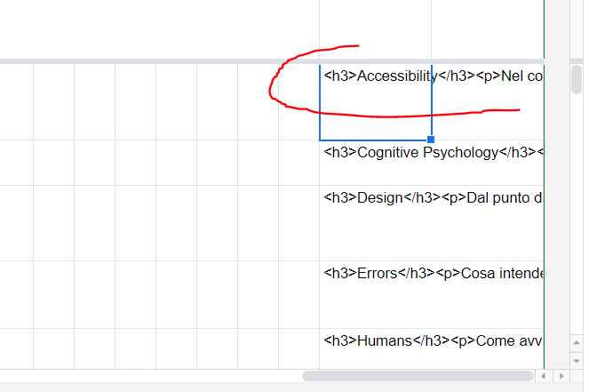

# Creare un esame di UUX su EOL

1. Creare, selezionare e filtrare le domande su: 

[UUX - Database delle domande](https://docs.google.com/spreadsheets/d/1rcTA9yQJZTwakuPhlWLDqr9IoXs2lHynbcJTufAcQz8/edit?usp=drivesdk)

2. Una volta filtrate le domande, andare nell’ultima colonna a dx e **copiare la formula su tutte le domande selezionate**:

3. **Selezionare tutta la colonna con il markup e copiarla in un blocco note**, andando a capo dopo ogni `
`. Salvare il file in locale.
4. Andare su [https://www.fabiovitali.it/EOL/](https://www.fabiovitali.it/EOL/).
5. Cancellare le domande preesistenti (icona cestino).
6. **Caricare il .txt delle domande** cliccando sull’icona azzurrina del cloud in alto a sx.
7. Aggiungere la categoria a ciascuna domanda.
8. **Generare le domande** (icona blu con freccia al centro).
9. Cliccare su **Salva domande (Moodle XML)**.
10. Andare su [https://eol.unibo.it/my/](https://eol.unibo.it/my/).
11. Una volta dentro l’appello, cliccare sull’icona blu con gli ingranaggi.
12. Selezionare **Deposito delle domande > Importa**.
13. Formato file: **Formato Moodle XML**.
14. **Importare il file** precedentemente esportato in **Moodle XML**.
15. Ritornare sulla pagina degli appelli e **cliccare su Attiva modifica**.
16. Scorrere in fondo alla pagina e **cliccare su Aggiungi argomento**. Cliccare nuovamente **Aggiungi argomento** sul prompt.
17. Comparirà un nuovo box chiamato “Argomento N”. Rinominarlo e poi spostare l’argomento in cima alla pagina usando l’icona a croce sopra il box.
18. All’interno del box, **cliccare su Aggiungi un’attività o una risorsa**.
19. **Cliccare su Quiz**.
20. Nella pagina che si apre, dare un titolo al Quiz e selezionare (alla sezione Durata) una durata di inizio e di fine del test (dopo aver abilitato i rispettivi checkbox).
21. **Cliccare su Salva e torna al corso**.
22. Nel box, **cliccare su Modifica > Nascondi**, per nascondere il quiz agli studenti.
23. **Fabio DEVE CHIUDERE L’APPELLO**, altrimenti i restanti passaggi non risulteranno operativi.
24. Nel box, cliccare sul nome del test con a fianco la spunta.
25. Nella pagina che si apre, **cliccare su Modifica quiz**.
26. **Modificare il Voto massimo a 100,00** e salvare.
27. Cliccare su **Aggiungi > dal deposito domande** in basso a destra.
28. Nella finestra che si apre, **Scegliere la categoria** corretta dal dropdown in alto, checkare tutte le domande (se corrette) e **cliccare Aggiungi al quiz** le domande selezionate.
29. Una volta caricate correttamente le domande, ricordarsi di **cliccare su Termina modifica** in alto.
30. Fatto! **Ricordarsi di maledire EOL** (e fare 10 minuti di stretching).
